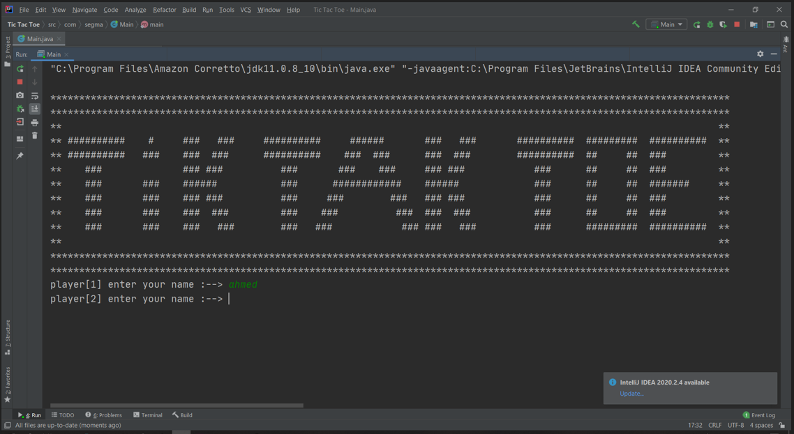
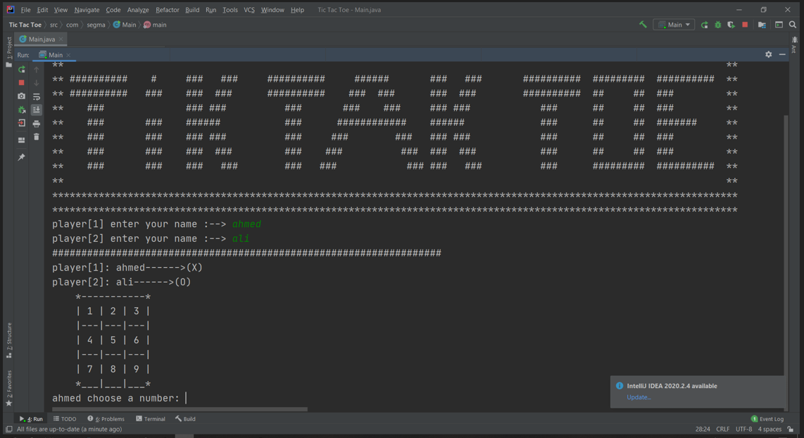
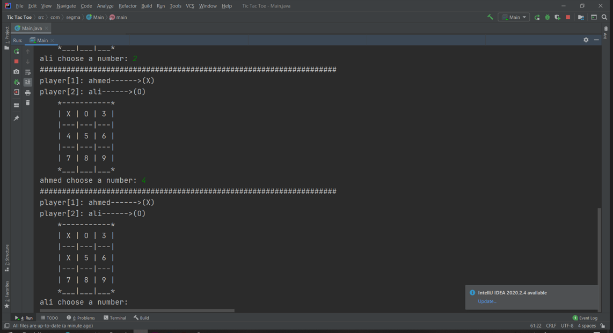
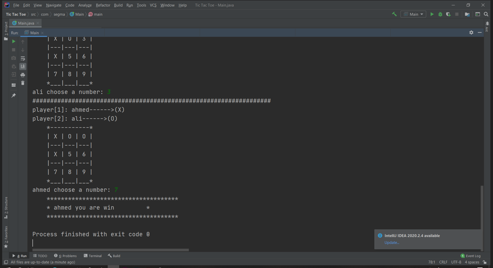

# TicTacToe-Java

### A simple Tic-Tac-Toe game built using Java for two players. 
   
---

## Features
- Two-player mode (Player 1 vs Player 2)
- Random assignment of `X` and `O` to players
- Easy-to-use command-line interface
- Input validation to prevent overwriting spots
- Automatically detects the winner or a draw
---

## Gameplay Instructions
1. Clone the repository:
   ```bash
   git clone https://github.com/YourUsername/TicTacToe-Java.git
   cd TicTacToe-Java
   ```
2. Compile the Java code:
   ```bash
   javac com/segma/Main.java
   ```
3. Run the game:
   ```bash
   java com.segma.Main
   ```
5. Follow the on-screen instructions to make your moves:
   
   
   
   

## Project Structure
- `com/segma/Main.java`: The main class that contains the game logic and user interface.
```
TicTacToe-Java/
├── com/
│   └── segma/
│       └── Main.java   # Main game logic
├── images/
│   └── game_preview.png   # Screenshot of the game
└── README.md
```
